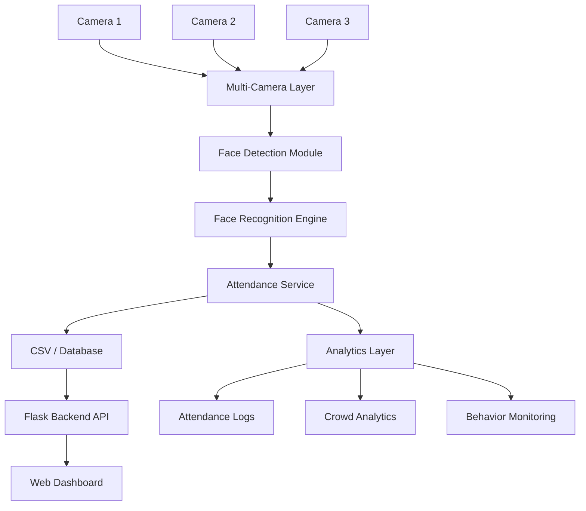

# AI Attendance System  

[](https://www.python.org/)
[](LICENSE)
[](https://github.com/yourusername/AI-Attendance-System)
[]()

## Project Overview
A complete AI-driven attendance platform that uses face recognition,
anti-spoofing, and analytics to automatically log presence from one or more
camera streams. Designed for educational and corporate environments,
it simplifies attendance tracking and provides real-time insights.

## Key Features
- AI face recognition attendance
- Anti-spoof detection
- Multi-camera support
- Smart analytics dashboard
- Crowd monitoring
- Mobile attendance support

## System Architecture
Core components are organised into separate modules (see `docs/architecture.md`):
- **core/** – recognition engine, camera manager, services and utilities
- **backend/** – Flask API server powering dashboard and mobile endpoints
- **analytics/** – runtime data, heatmaps and logs generated during operation
- **frontend/** – static web dashboard and mobile UI assets



## Quick Start

### Windows
```cmd
setup.bat
run.bat
```

### Linux/macOS
```bash
chmod +x setup.sh run.sh
./setup.sh
./run.sh
```

The setup script will:
- Create a virtual environment
- Install all dependencies
- Create required folders (dataset/, attendance/, logs/)

The run script will:
- Check for camera and dataset
- Start the AI Attendance System

**First-time setup:** If the dataset folder is empty, run `python capture_faces.py` to capture face data before starting the system.

## Installation

```bash
pip install -r requirements.txt
```

## Running the System

```bash
python capture_faces.py
python run_system.py
```

## Screenshots


*(Add your own images in `docs/screenshots/` and update paths above.)*

## Demo
To showcase the system, add example images or videos to `docs/screenshots/` and
refer to them here. A short demo GIF can be placed under `docs/demo.gif`.

## Future Improvements
- Docker containerization for easy deployment
- Mobile app with QR/face hybrid login
- Centralized cloud database and user management
- Enhanced anti-spoof with liveness detection models
- Integration with LMS platforms

---
*See `docs/system_flow.md` for detailed data flow description.*
