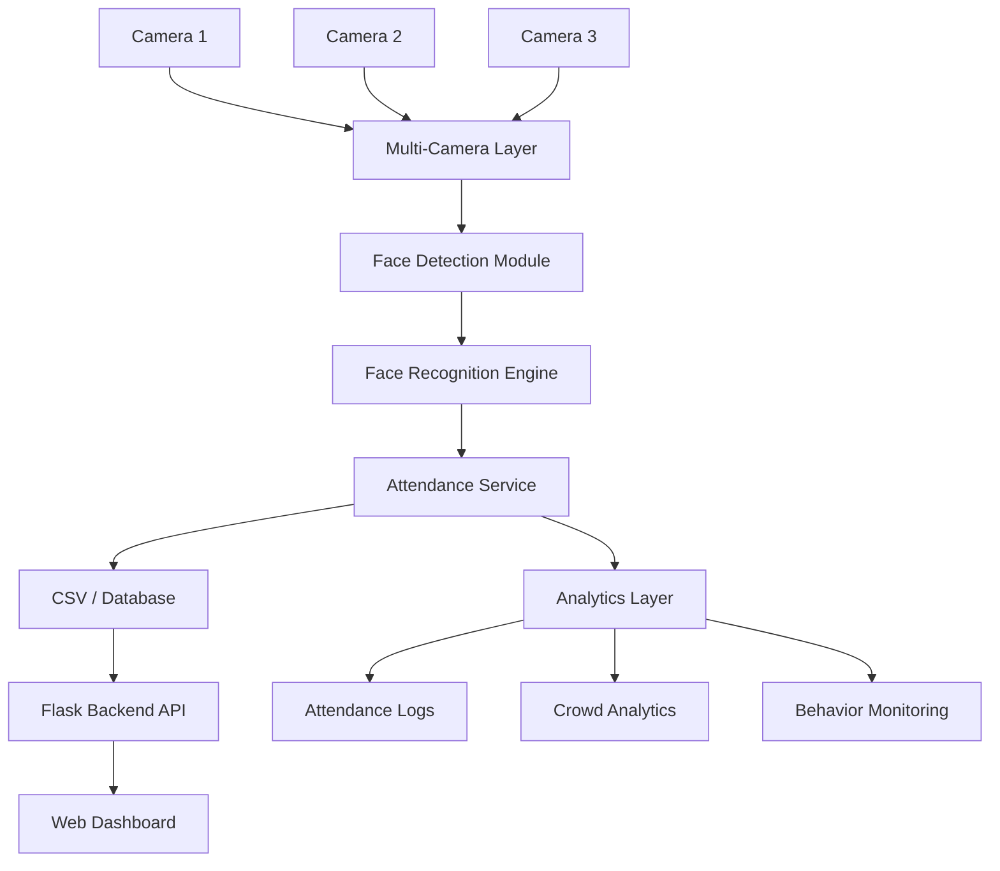

# 🚀 AI Face Recognition Attendance System  

[](https://www.python.org/)
[](LICENSE)
[](https://github.com/Kiran190306/AI-Attendance-System)
[]()

## Project Overview
A complete AI-driven attendance platform that uses face recognition,
anti-spoofing, and analytics to automatically log presence from one or more
camera streams. Designed for educational and corporate environments,
it simplifies attendance tracking and provides real-time insights.

## Key Features
- AI face recognition attendance
- Anti-spoof detection
- Multi-camera support
- Smart analytics dashboard
- Crowd monitoring
- Mobile attendance support

## System Architecture
Core components are organised into separate modules (see `docs/architecture.md`):
- **core/** – recognition engine, camera manager, services and utilities
- **backend/** – Flask API server powering dashboard and mobile endpoints
- **analytics/** – runtime data, heatmaps and logs generated during operation
- **frontend/** – static web dashboard and mobile UI assets



## Quick Start

### Windows
```cmd
setup.bat
run.bat
```

### Linux/macOS
```bash
chmod +x setup.sh run.sh
./setup.sh
./run.sh
```

The setup script will:
- Create a virtual environment
- Install all dependencies
- Create required folders (dataset/, attendance/, logs/)

The run script will:
- Check for camera and dataset
- Start the AI Attendance System

**First-time setup:** If the dataset folder is empty, run `python capture_faces.py` to capture face data before starting the system.

## Installation

```bash
pip install -r requirements.txt
```

## Running the System

```bash
python capture_faces.py
python run_system.py
```

## Cloud Deployment (NEW!)

### Hybrid Cloud Architecture

Transform your attendance system into a **Hybrid Cloud Deployment** where:
- **Local** machine runs face recognition (fast, private, offline-capable)
- **Cloud** backend stores and serves attendance data (accessible anywhere)
- **Automatic sync** between local and cloud systems
- **Public dashboard** accessible via web link

```
Local Cameras + AI Recognition
        ↓
Mark Attendance Locally
        ↓
Auto-Sync to Cloud
        ↓
Accessible Online Dashboard
```

### Quick Cloud Setup (5 minutes)

1. **Deploy Cloud Backend on Render** (Free tier available)
   ```bash
   # 1. Push code to GitHub
   git push origin main
   
   # 2. Go to render.com → New Web Service
   # 3. Select your GitHub repo
   # 4. Build Command: pip install -r cloud_backend/requirements.txt
   # 5. Start Command: cd cloud_backend && gunicorn app:app
   ```

2. **Configure Local System**
   ```bash
   # Update .env.local with your cloud URL
   CLOUD_API_URL=https://your-app.onrender.com
   CLOUD_SYNC_ENABLED=true
   ```

3. **Start Syncing**
   ```python
   from sync import init_sync_client
   sync_client = init_sync_client('https://your-app.onrender.com')
   sync_client.start_sync()
   ```

4. **Access Dashboard**
   - Open: `https://your-app.onrender.com/`
   - See real-time attendance statistics
   - Export attendance data as JSON

### Deployment Features

✓ **Automatic Sync** - Background worker syncs attendance every 5 seconds  
✓ **Offline Support** - Queue system persists data if internet is unavailable  
✓ **Smart Retry** - Automatic retries with exponential backoff  
✓ **Web Dashboard** - Real-time attendance statistics and logs  
✓ **REST API** - Endpoints for marking and querying attendance  
✓ **Data Export** - Download attendance records as JSON  
✓ **Multi-Camera** - Support for multiple local machines syncing to same cloud  

### API Endpoints

```bash
# Mark attendance
POST /api/attendance/mark
{
  "name": "John Doe",
  "confidence": 0.95,
  "camera_id": "camera_1"
}

# Get today's attendance
GET /api/attendance/today

# Get all attendance records
GET /api/attendance?limit=50&offset=0

# Get statistics
GET /api/stats

# Export data
GET /api/attendance/export

# Health check
GET /health
```

### Documentation

- **[Hybrid Cloud Architecture](HYBRID_CLOUD_ARCHITECTURE.md)** - Detailed architecture and components
- **[Cloud Deployment Guide](CLOUD_DEPLOYMENT_GUIDE.md)** - Step-by-step deployment instructions
- **[API Reference](HYBRID_CLOUD_ARCHITECTURE.md#api-endpoints)** - Complete API documentation

### Deployment Options

**Recommended (Free tier):**
- [Render.com](https://render.com/) - Simple, free tier with automatic deployments

**Alternative Hosting:**
- Heroku - ($5-50/month, free tier removed)
- AWS - (pay-as-you-go)
- Google Cloud - (pay-as-you-go)
- PythonAnywhere - (free tier available)

### Example: Complete Integration

```python
import os
from dotenv import load_dotenv
from core.attendance_service_cloud import AttendanceServiceWithCloudSync
from sync import init_sync_client

# Load configuration
load_dotenv('.env.local')
cloud_url = os.getenv('CLOUD_API_URL')

# Initialize sync client
sync_client = init_sync_client(cloud_url)
sync_client.start_sync()

# Initialize attendance service with cloud sync
attendance = AttendanceServiceWithCloudSync(enable_cloud_sync=True)

# Mark attendance (automatically syncs to cloud)
attendance.mark(
    student_name='John Doe',
    confidence=0.95,
    camera_id='camera_1'
)

# Check sync status
sync_status = attendance.get_sync_status()
print(f"Sync Health: {sync_status['is_healthy']}")
```

### Project Structure

```
cloud_backend/              # Cloud Flask application
├── app.py                 # Main Flask app
├── routes/
│   └── attendance_routes.py   # API endpoints
├── templates/
│   └── dashboard.html     # Web dashboard
├── Procfile              # Render deployment config
└── requirements.txt      # Cloud dependencies

sync/                      # Sync module for local system
├── __init__.py
└── sync_client.py        # Background sync worker

core/
└── attendance_service_cloud.py  # Enhanced service with sync

.env.local                 # Local configuration (create from .env.example)
```

### Performance & Reliability

- **Non-blocking sync** - Face recognition not slowed by network I/O
- **Offline-first** - Works completely without internet
- **Smart queueing** - Persists unsent records across restarts
- **Batch processing** - Efficient API usage (10 records per request)
- **Automatic retry** - Up to 5 retry attempts per record
- **Status monitoring** - Check sync health anytime

### Security Considerations

**Current (Development)**
- Suitable for internal networks
- No authentication required
- JSON data storage

**Production Recommendations**
1. Add API authentication (JWT/API keys)
2. Use HTTPS/SSL certificates
3. Encrypt sensitive data
4. Implement database instead of JSON
5. Add rate limiting and IP whitelisting
6. Regular backups and disaster recovery

### Troubleshooting Cloud Deployment

**Dashboard not loading?**
```bash
# Test cloud connection
curl https://your-app.onrender.com/health

# Check Render logs
# Go to Render dashboard → Logs
```

**Sync not working?**
```bash
# Verify config
cat .env.local | grep CLOUD_API_URL

# Check local queue
ls -la .sync_queue.json

# Force sync
python -c "from sync import get_sync_client; get_sync_client().force_sync()"
```

**Records not syncing?**
1. Verify internet connectivity
2. Check cloud backend is running
3. Review sync statistics: `get_sync_client().get_stats()`
4. Check cloud storage: `cloud_backend/data/attendance.json`

### Next Steps

1. Read [Hybrid Cloud Architecture](HYBRID_CLOUD_ARCHITECTURE.md) for detailed design
2. Follow [Cloud Deployment Guide](CLOUD_DEPLOYMENT_GUIDE.md) for step-by-step setup
3. Deploy cloud backend on Render
4. Configure and test local sync
5. Monitor dashboard and attendance data
6. Scale to production (database, authentication, etc.)

---

## Screenshots


*(Add your own images in `docs/screenshots/` and update paths above.)*

## Demo
To showcase the system, add example images or videos to `docs/screenshots/` and
refer to them here. A short demo GIF can be placed under `docs/demo.gif`.

## Future Improvements
- Docker containerization for easy deployment
- Mobile app with QR/face hybrid login
- Centralized cloud database and user management
- Enhanced anti-spoof with liveness detection models
- Integration with LMS platforms

##AI-powered smart attendance system using face recognition, analytics dashboard, and multi-camera support.

## 💡 Use Cases

- Smart Classroom
- Office Attendance
- Secure Entry Systems
---
*See `docs/system_flow.md` for detailed data flow description.*
