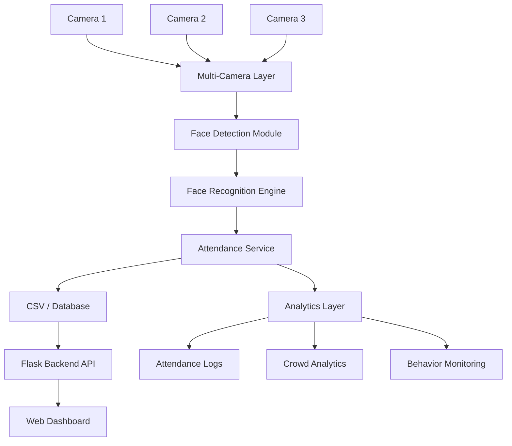

# System Architecture Diagram

```mermaid
flowchart TD
    C1[Camera 1] --> MCL[Multi-Camera Layer]
    C2[Camera 2] --> MCL
    C3[Camera 3] --> MCL
    MCL --> FDM[Face Detection Module]
    FDM --> FRE[Face Recognition Engine]
    FRE --> AS[Attendance Service]
    AS --> DB[CSV / Database]
    DB --> FBAPI[Flask Backend API]
    FBAPI --> WD[Web Dashboard]
    AS --> AL[Analytics Layer]
    AL --> AL1[Attendance Logs]
    AL --> AL2[Crowd Analytics]
    AL --> AL3[Behavior Monitoring]
```